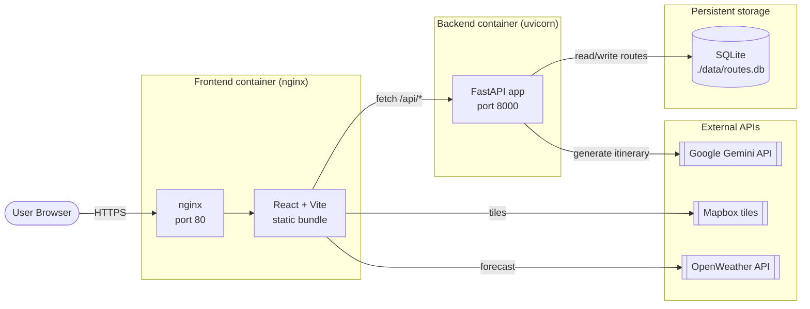
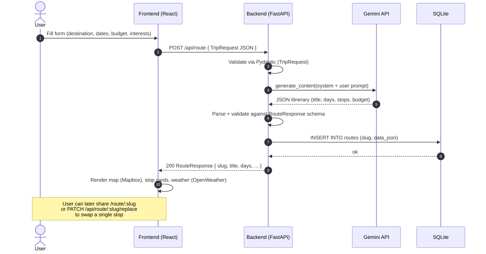

# Architecture

This document describes how AI-Voyage is structured at runtime: the moving
parts, where they live, and how a single user request flows end-to-end.

## High-level diagram



ASCII fallback for environments that don't render Mermaid:

```
                +----------------+
                |  User Browser  |
                +-------+--------+
                        |
                        v  HTTPS
              +---------+---------+
              |  Frontend (nginx) |   port 80
              |  React + Vite SPA |
              +----+----------+---+
                   |          |
       fetch /api/*|          | tiles / forecast
                   v          v
        +----------+----+   +---------------------+
        | Backend       |   | Mapbox / OpenWeather|
        | FastAPI       |   +---------------------+
        | port 8000     |
        +---+-------+---+
            |       |
   read/write       generate
            |       |
            v       v
        +-------+ +-----------------+
        |SQLite | | Google Gemini   |
        |routes | | API             |
        | .db   | +-----------------+
        +-------+
```

## Components

| Component | Tech | Responsibility |
|---|---|---|
| **Frontend container** | nginx serving a Vite-built React/TypeScript bundle | Renders UI, talks to backend via `/api/*`, fetches Mapbox tiles and OpenWeather forecasts directly. |
| **Backend container** | FastAPI on uvicorn (Python 3.12) | Validates requests, calls Gemini to generate itineraries, persists routes, exposes Prometheus metrics at `/metrics`. |
| **SQLite** | Single file at `./data/routes.db` (mounted volume locally; ephemeral on Railway without a volume) | Stores routes keyed by short `slug`, retrieved on shareable URLs. |
| **Google Gemini API** | `gemini-2.5-flash` via `google-genai` SDK | Generates structured JSON itineraries and replacement stops based on user trip parameters. |
| **OpenWeather API** | Public REST API | Provides per-day weather forecasts shown next to each route day on the frontend. |
| **Mapbox** | GL JS + tile API with a public `pk.*` token | Renders the interactive route map in the browser. |
| **Prometheus + Grafana** | `docker-compose.yml` (local dev) and Grafana Cloud (production via Alloy) | Scrape `/metrics` from the backend; dashboards visualise request rate, latency, Gemini call counts. |

## Data flow: creating a route

The diagram below traces what happens when a user submits the trip form.



### Step-by-step

1. **Form submit.** The user fills out the trip form (`destination`, `start_date`, `end_date`, `budget`, `interests`) and submits.
2. **Validation.** The backend validates the body with the `TripRequest` Pydantic model. Bad input returns `422` with a flat list of human-friendly messages (see `app/errors.py`).
3. **Gemini call.** `generate_route()` builds a system + user prompt, calls Gemini, retries up to 3 times on transient errors (5xx, 429, deadline exceeded) with exponential backoff, and counts each attempt in the `gemini_api_calls_total` Prometheus metric.
4. **Schema parse.** Raw JSON is unwrapped from any markdown fences, missing stop IDs are auto-filled (`stop_{day}_{idx:03d}`), and the result is validated against `RouteResponse`.
5. **Persist.** A short `slug` (8-char nanoid) is generated; the route is stored as JSON in SQLite. Slug collisions are retried up to 5 times before falling back to a 12-char slug.
6. **Response.** The backend returns the full `RouteResponse` with `slug` filled in.
7. **Render.** The frontend draws the route on a Mapbox map, lists stops day-by-day, and fetches weather for each day from OpenWeather directly from the browser.
8. **Share / edit.** The slug becomes a shareable URL (`/route/:slug` is fetched via `GET /api/route/:slug`). Replacing a single stop sends `PATCH /api/route/:slug/replace`, which calls Gemini again for one stop, swaps it in place, and `UPDATE`s the row in SQLite.

## Deployment topology (Railway)

In production, the two containers run as **separate Railway services** on the
same project, each built from its own `Dockerfile`:

- `ai-voyage-production.up.railway.app` — backend
- `gleaming-endurance-production-07af.up.railway.app` — frontend

A third Railway service (`alloy`) runs Grafana Alloy, which scrapes the
backend's `/metrics` endpoint every 15 s and `remote_write`s to Grafana Cloud
Hosted Prometheus. There is **no shared docker-compose** in production — that
file is local-dev only.
